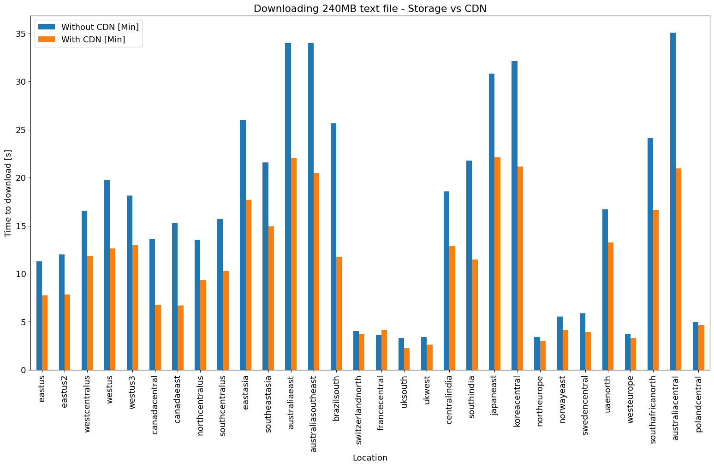
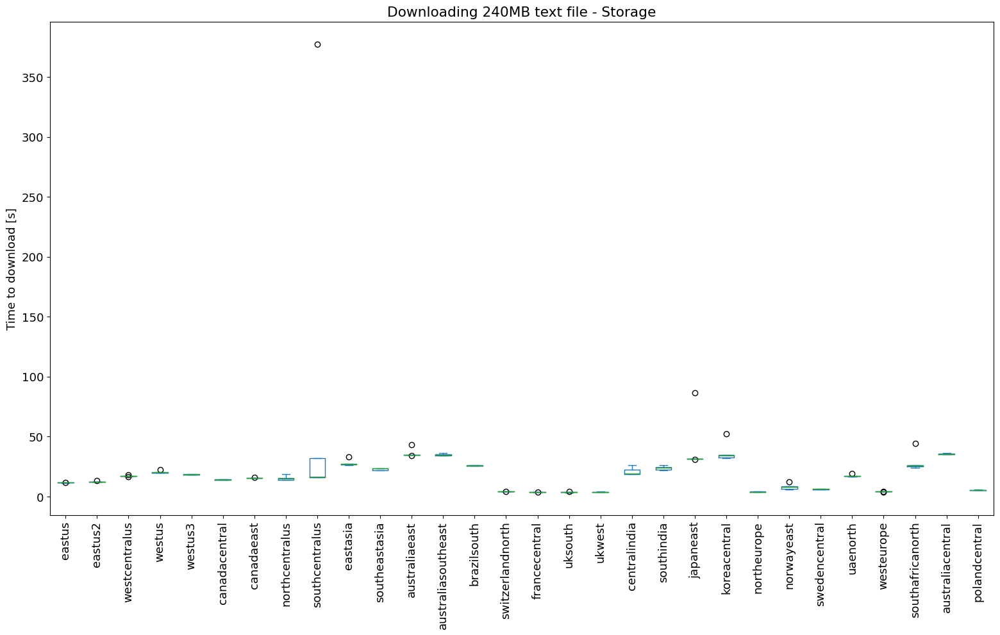

Config:  
- command: `TIMEFORMAT=%R;time wget -q {url} -O /dev/null`  
- filesize: `240MB`  
- storage region: `UK South`  
- N_measurements: `5`  
- setup: `single download from each location before measuring`  
- instance type: `Standard_B1s`  

